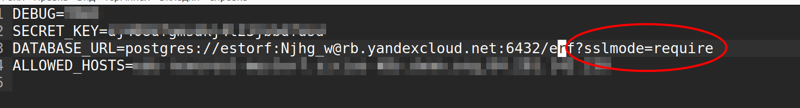
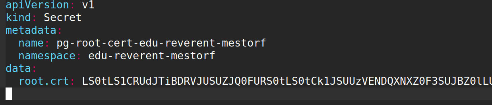
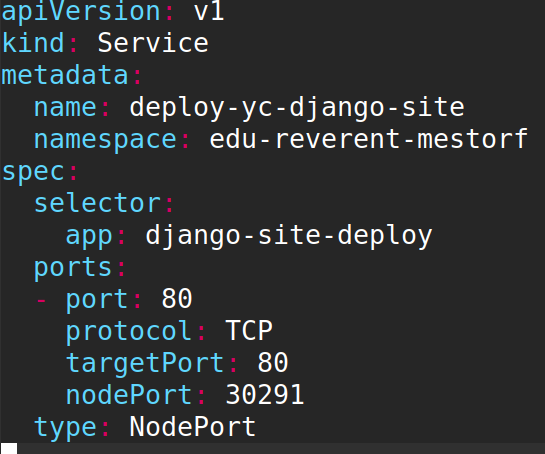

## Как "задеплоить код”. На примере образа NGINX 

Получите доступ к кластеру. В качестве примера будет рассмотрен пример кластера в Яндекс облака
Необходимо получить свой namespace. К нему будет выдан полный доступ: можно создавать конфиги и секреты, запускать поды — делать всё, что потребуется для настройки и запуска веб-сервиса
Вам будет выделен домен и создан роутер. Он распределит входящие сетевые запросы на разные NodePort кластера K8s.
Пример
1. Создание тома постоянного хранилища данных для postgres размером 3Gb
```sh
#Имя файла - yc-sirius/edu-reverent-mestorf/Nginx test/Deployment.yaml
apiVersion: apps/v1
kind: Deployment
metadata:
  name: deployment-nginx
  namespace: edu-reverent-mestorf
spec:
  replicas: 2
  selector:
    matchLabels:
      app: nginx-deployment
  template:
    metadata:
      labels:
        app: nginx-deployment
    spec:
      containers:
      - image: nginx
        name: nginx-l2-devman
        ports:
        - containerPort: 80
          protocol: TCP
      restartPolicy: Always
```
```sh
#Имя файла - yc-sirius/edu-reverent-mestorf/Nginx test/Service.yaml
apiVersion: v1
kind: Service
metadata:
  name: deployment-nginx
  namespace: edu-reverent-mestorf
spec:
  selector:
    app: nginx-deployment
  ports:
  - port: 80
    protocol: TCP
    targetPort: 80
    nodePort: 30291
  type: NodePort
```
## Как подготовить dev окружение
Для взаимодействия с БД необходимо получить и использовать файл сертификата.
Подключение к базе данных в кластере PostgreSQL. 
PostgreSQL-хосты с публичным доступом поддерживают только шифрованные соединения. Чтобы использовать их, получите SSL-сертификат:
```sh
mkdir -p ~/.postgresql && \
wget "https://storage.yandexcloud.net/cloud-certs/CA.pem" \
     --output-document ~/.postgresql/root.crt && \
chmod 0600 ~/.postgresql/root.crt
```
Сертификат будет сохранен в файле ~/.postgresql/root.crt.
Используем полученный файл `root.crt` при создании раздела secret
#Имя файла - yc-sirius/edu-reverent-mestorf/Nginx test with secret/secret.yaml


Для удобства можно использовать [сервис](https://base64.guru/converter/encode/file)

Сам файл для теста
#Имя файла - yc-sirius/edu-reverent-mestorf/Nginx test with secret/test_pod.yaml

## Пример использования образа для размещения на яндекс К8S
В качестве примера будем использовать созданный ранее докер образ на [hub.docker.com](https://hub.docker.com/repository/docker/zatomis/k8s-2/general)
из [репозитория](https://github.com/devmanorg/k8s-test-django).
1. Создаем раздел сикретов из переменных окружения для функционирования сайта
```
kubectl --namespace=edu-reverent-mestorf create secret generic my-secret --from-env-file=.env
```
Обратите внимание, что для запуска БД PostgreSQL в переменных окружения нужно указать sslmode=require


2. Создать раздел сикретов для ssl сертификата. Предварительно создав файл-сертификат см. `Как подготовить dev окружение`
файл dev-k8s-yc/yc-sirius/edu-reverent-mestorf/Deploy Django site/secret.yaml

```sh
kubectl create -f secret.yaml
```

3. Создать сервис для доступа к сайту файл dev-k8s-yc/yc-sirius/edu-reverent-mestorf/Deploy Django site/service.yaml

```sh
kubectl create -f service.yaml
```

4. Создать deploy в облаке яндекс для доступа к сайту файл dev-k8s-yc/yc-sirius/edu-reverent-mestorf/Deploy Django site/deploy.yaml
```sh
kubectl create -f deployment.yaml
```